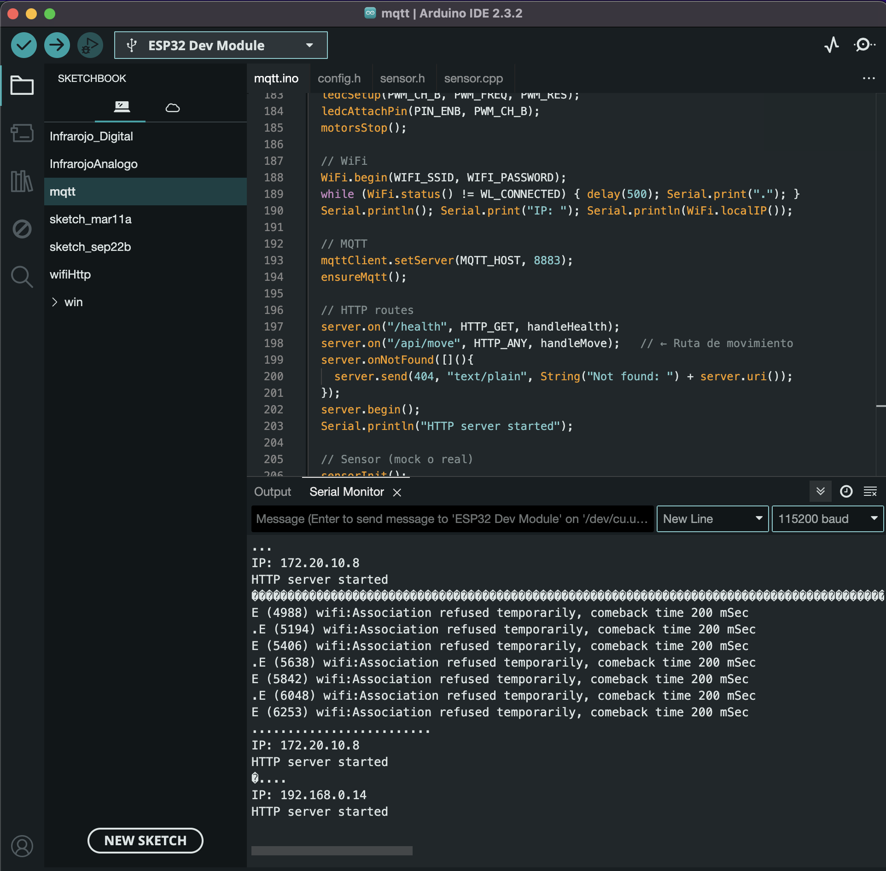
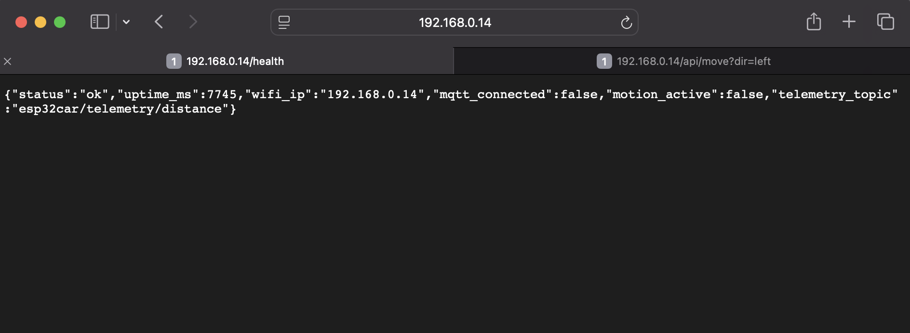
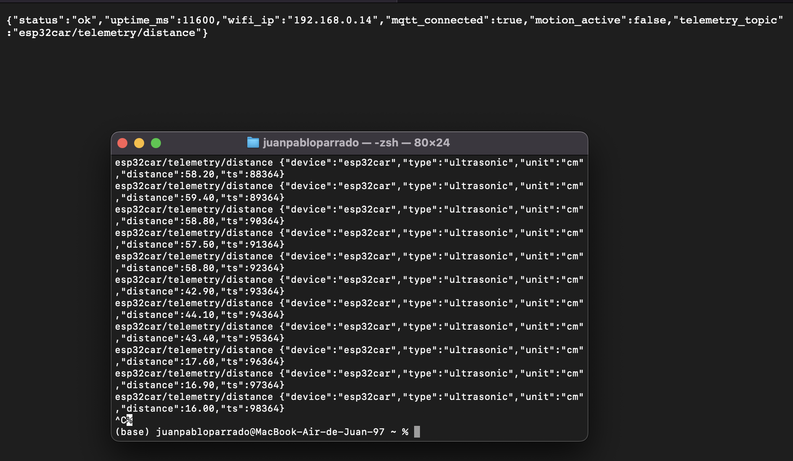
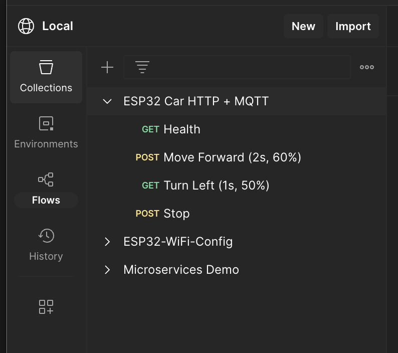
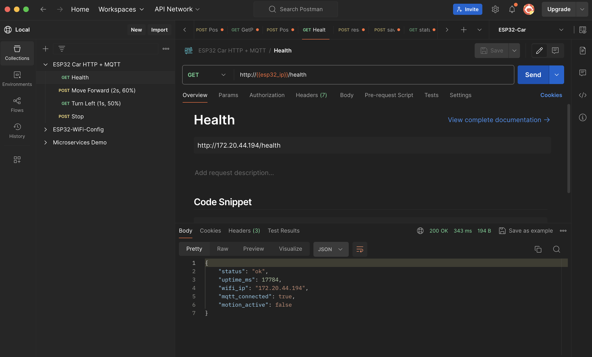
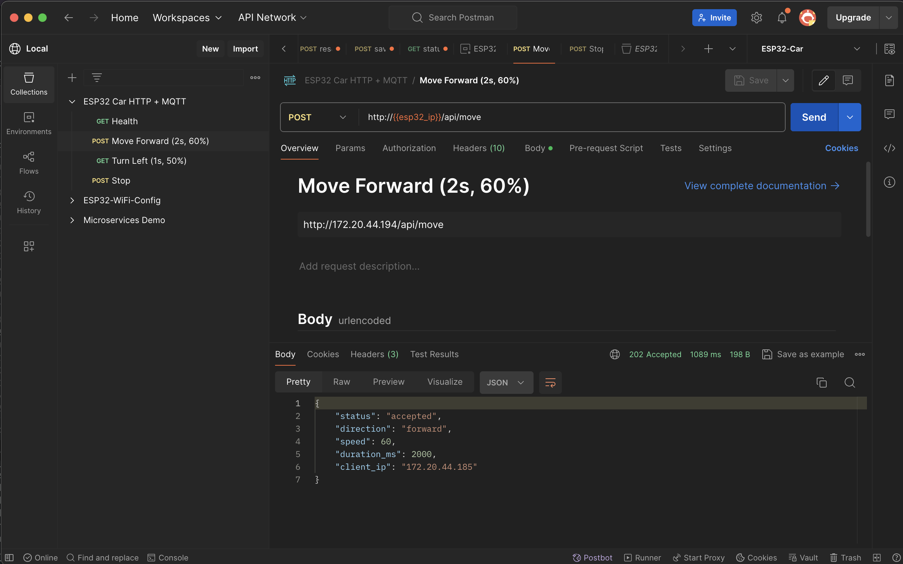
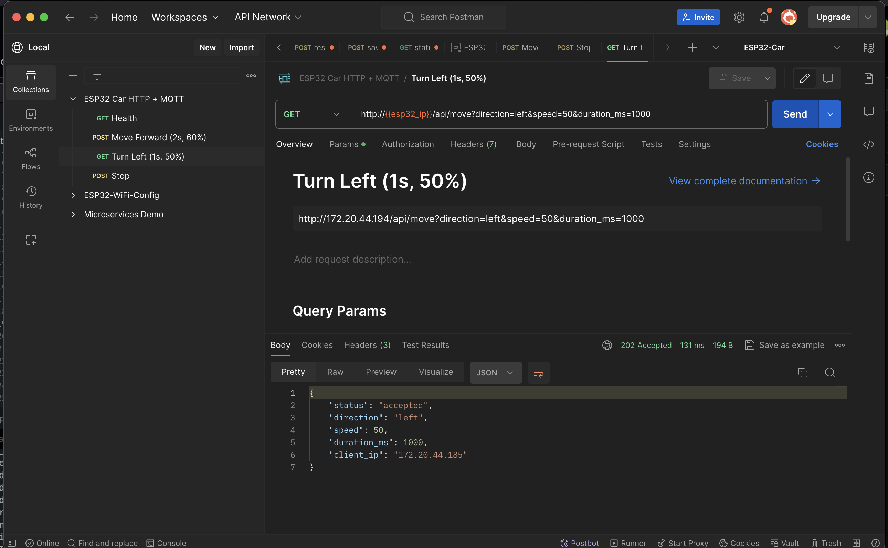
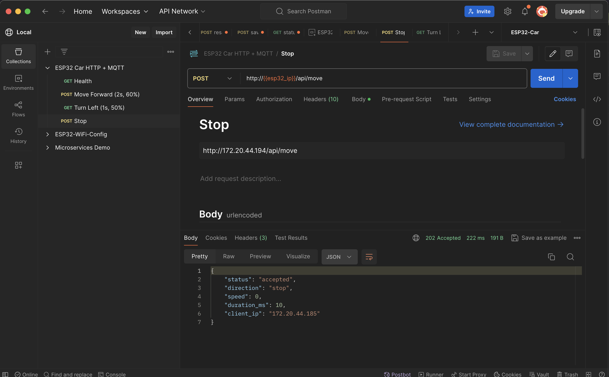

# Evidencia – MQTT Seguro (TLS) + Telemetría del Robot ESP32
Nicolás Clavijo y Juan Pbalo Parrado
En esta sección presento la evidencia completa del funcionamiento del robot ESP32 utilizando **MQTT seguro (TLS por puerto 8883)** contra el broker público **test.mosquitto.org**, así como la verificación desde el cliente y el estado interno expuesto por el endpoint **/health**.

El proceso realizado fue el siguiente:

1. **Configuración del ESP32 para usar MQTT sobre TLS**

   * Se extrajo el certificado del broker usando `openssl s_client`.
   * Se creó el archivo `root_ca.h` y se cargó en el firmware.
   * El ESP32 usa `WiFiClientSecure` con `setCACert()` para validar el servidor.

2. **Verificación de conexión desde el ESP32**

   * El endpoint `/health` muestra si el módulo logró conectarse vía MQTT seguro.
   * Una vez cargado el certificado correcto, el ESP32 reporta `mqtt_connected: true`.

3. **Suscripción desde el cliente usando TLS**

   * Desde mi Mac se realizó la suscripción a `esp32car/telemetry/distance` usando `mosquitto_sub` con `--cafile`.
   * Se recibieron en tiempo real los valores de distancia enviados por el sensor ultrasónico.

4. **Validación de funcionamiento completo**

   * El robot está conectado, enviando telemetría periódica y sirviendo el endpoint HTTP.
   * Se realizó captura de cada etapa: conexión parcial, error por certificado faltante y conexión final correcta.

---

### A continuación dejo las evidencias solicitadas:

(ahora pones las imágenes tal como te lo pide tu profesor)

* **Imagen 1 – Conexión MQTT segura exitosa**
* 
* **Imagen 2 – Fallo al validar TLS sin certificado**
* 
* **Imagen 3 – Con certificado cargado → conexión estable** y ** Telemetría recibida en tiempo real desde `mosquitto_sub`**


Aquí tienes un párrafo perfecto para tu entrega:

---

Además, todas las preguntas solicitadas en el taller fueron respondidas y se encuentran organizadas en un archivo **Markdown (`CERTIFICATES.md`)**, tal como se pidió en las instrucciones. De igual forma, **todo el código utilizado**, incluyendo el firmware del ESP32, las rutas HTTP, la configuración MQTT y los archivos auxiliares (`root_ca.h`, `settings.h`, etc.), está completamente disponible y versionado en este repositorio de **Git** correspondiente para su revisión.

---

# Estos eran talleres anteriores:

# ESP32 Car HTTP + MQTT: Guía de uso con Postman, Mosquitto y sensor de distancia.

Este documento explica **cómo controlar el carro desde Postman** y cómo **verificar las publicaciones MQTT** en `test.mosquitto.org` usando `mosquitto_sub`.

---

- Link Chatgpt: [https://chatgpt.com/share/68e6ef12-c018-8007-91c2-bfa94164f942] 

## 1. Requisitos

- ESP32 conectado al WiFi (en el Monitor Serie debe mostrar algo como):
  ```
  WiFi connected, IP: 172.20.44.194
  ```
- Postman instalado → [https://www.postman.com/downloads](https://www.postman.com/downloads)
- Cliente Mosquitto instalado:
  - macOS: `brew install mosquitto`
  - Linux: `sudo apt install mosquitto-clients`
  - Windows: [https://mosquitto.org/download/](https://mosquitto.org/download/)

  - Descargar y pasar el código llamado mqtt1 a la ESP32
  - descargar el archivo .jsn en PostMan
---

## 2. Configurar Postman

1. Abre Postman → **Import** → selecciona el archivo `docs/postman_collection.json` del proyecto.
   
   * *
   *Ejemplo de cómo debe quedar*
3. Crea un **Environment** (entorno):
   - Nombre: `ESP32-Car`
   - Variable: `esp32_ip`
   - Valor: la IP de tu ESP32 (ejemplo: `172.20.44.194`)
4. Activa el environment desde la parte superior derecha.

---

## 3. Probar endpoints

En la colección **ESP32 Car HTTP + MQTT**:

* *
   *Verifica el estado*
### `GET /health`
Verifica conexión y estado:
```json
{
  "status": "ok",
  "wifi_ip": "172.20.44.194",
  "mqtt_connected": false,
  "motion_active": false
}
```

* *
   *Mueve hacia adelante*
### `POST /api/move`
Envía una instrucción de movimiento con parámetros:
- `direction`: `forward|backward|left|right|stop`
- `speed`: 0–100
- `duration_ms`: hasta 5000

Ejemplo:
```bash
curl "http://172.20.44.194/api/move?direction=forward&speed=60&duration_ms=2000"
```
Respuesta esperada:
```json
{
  "status": "accepted",
  "direction": "forward",
  "speed": 60,
  "duration_ms": 2000,
  "client_ip": "172.20.44.100"
}
```

* *
*TGira hacia la izquierda*

* *
*Para el carro*
---

## 4. Verificar MQTT con Mosquitto

Abre una terminal nueva y ejecuta:

```bash
mosquitto_sub -h test.mosquitto.org -t esp32car/commands -v
```

Esto **escucha los mensajes publicados por el ESP32** cuando recibe órdenes HTTP.

Ejemplo de salida:
```
esp32car/commands {"status":"accepted","direction":"forward","speed":60,"duration_ms":2000,"client_ip":"172.20.44.100","ts":345678}
```

---

## 5. ¿Por qué usamos `mosquitto_sub`?

-  **Verificación:** demuestra que el ESP32 publica las instrucciones por MQTT (parte del requisito del proyecto).  
-  **Auditoría:** permite ver cada mensaje JSON en tiempo real.  
-  **Diagnóstico:** si no ves mensajes, sabes que el problema está en la conexión MQTT o en que la orden no fue aceptada.

> El carro se controla 100% por HTTP, pero usamos `mosquitto_sub` para **comprobar** que las publicaciones MQTT están funcionando.

---

## 6. Problemas comunes

| Problema | Causa | Solución |
|-----------|--------|----------|
| `/health` muestra `mqtt_connected: false` | El ESP32 no logra conectar al broker | La red puede bloquear el puerto 1883; prueba con otra red o un hotspot móvil |
| No ves mensajes en Mosquitto | Estás en otro topic o la orden fue rechazada | Usa exactamente `esp32car/commands` y verifica que `/api/move` devuelve 202 |
| El carro no se mueve | Cableado incorrecto o inversión de pines | Revisa los pines del L298N, usa movimientos cortos de prueba |
| El broker está saturado | `test.mosquitto.org` es público | Cambia a otro, como `broker.hivemq.com` |

---

## 7. Ejemplo completo de prueba

1. En una terminal:  
   ```bash
   mosquitto_sub -h test.mosquitto.org -t esp32car/commands -v
   ```

2. En Postman o terminal:
   ```bash
   curl "http://172.20.44.194/api/move?direction=forward&speed=60&duration_ms=2000"
   ```

3. Verás el movimiento físico y, en la terminal del paso 1, un mensaje publicado por MQTT.

---

 **Listo:** con esto puedes controlar el carro desde Postman y verificar en Mosquitto que las instrucciones se publican correctamente.
 
## 8. Telemetría ultrasónica (mock o sensor real)

````markdown
Además de publicar las instrucciones de movimiento, el ESP32 también **envía lecturas de distancia por MQTT cada segundo.**

- **Tema MQTT de comandos:** `esp32car/commands`  
- **Tema MQTT de telemetría:** `esp32car/telemetry/distance`

---

### ¿Qué significa?

El ESP32 mide (o simula) la distancia con el sensor ultrasónico **HC-SR04** y publica lecturas automáticas, sin que el usuario haga nada.

Cada publicación tiene este formato JSON:

```json
{
  "device": "esp32car",
  "type": "ultrasonic",
  "unit": "cm",
  "distance": 85.72,
  "ts": 561234
}
````

* `distance`: valor en centímetros (mock o real)
* `ts`: timestamp interno del ESP32
* Si no hay lectura válida, `distance` puede ser `null`

---

### Modo de simulación (mock)

Por defecto el proyecto está configurado con:

```cpp
#define USE_MOCK_SENSOR 1
```

Esto genera lecturas falsas entre **8 – 200 cm**, permitiendo probar sin conectar el sensor físico.

Si se usa el sensor real, solo hay que **comentar esa línea en `config.h`** y conectar los pines **TRIG** y **ECHO** (usando un divisor de voltaje para ECHO → 3.3 V).

---

### Ver las lecturas MQTT con Mosquitto

En una terminal nueva, suscríbete al **topic de telemetría**:

```bash
mosquitto_sub -h test.mosquitto.org -t esp32car/telemetry/distance -v
```

Deberías ver cada segundo algo como:

```
esp32car/telemetry/distance {"device":"esp32car","type":"ultrasonic","unit":"cm","distance":92.37,"ts":123456}
```

---

### Prueba completa con Postman + Mosquitto

1. Abre una terminal y suscríbete a **ambos topics**:

   ```bash
   mosquitto_sub -h test.mosquitto.org -t esp32car/commands -v &
   mosquitto_sub -h test.mosquitto.org -t esp32car/telemetry/distance -v &
   ```

2. En **Postman**:

   * Ejecuta `GET /health`
   * Luego:

     ```
     POST /api/move?direction=forward&speed=50&duration_ms=2000
     ```

3. En la terminal verás:

   * Mensajes del topic **`esp32car/commands`** (instrucciones del carro)
   * Mensajes de **`esp32car/telemetry/distance`** (distancias en cm)

 Esto demuestra que el ESP32 **recibe órdenes** y **reporta datos ambientales** por MQTT simultáneamente.

---

### Ejemplo gráfico del flujo

```
POSTMAN  --->  ESP32 (HTTP API)
                  |
                  |  → movimiento del carro
                  |
                  ↓
              MQTT broker (test.mosquitto.org)
                ↙             ↘
esp32car/commands        esp32car/telemetry/distance
```

```

---

¿Quieres que te dé ahora el bloque **“9. Resumen final del proyecto”** también en el mismo formato Markdown (con tablas y checklist) para cerrar perfectamente tu README?
```
